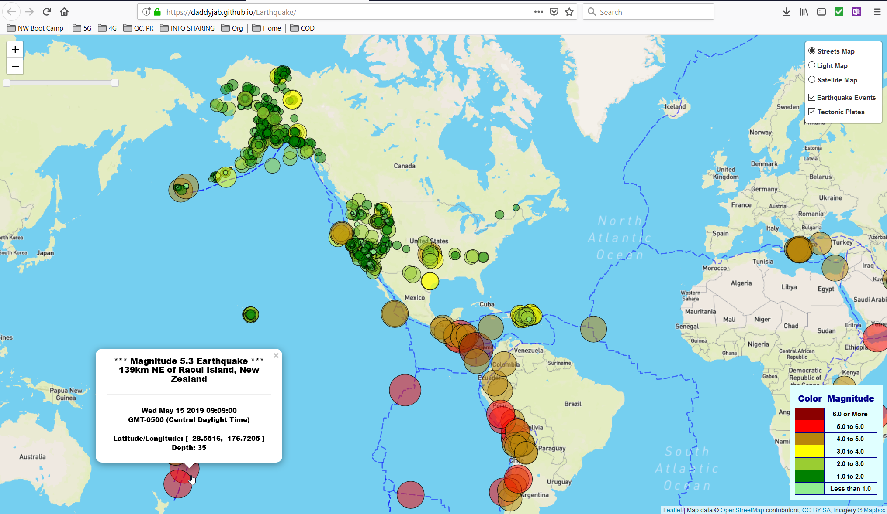
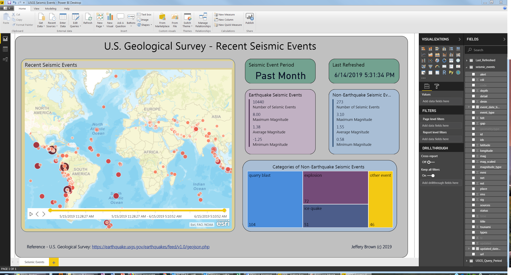
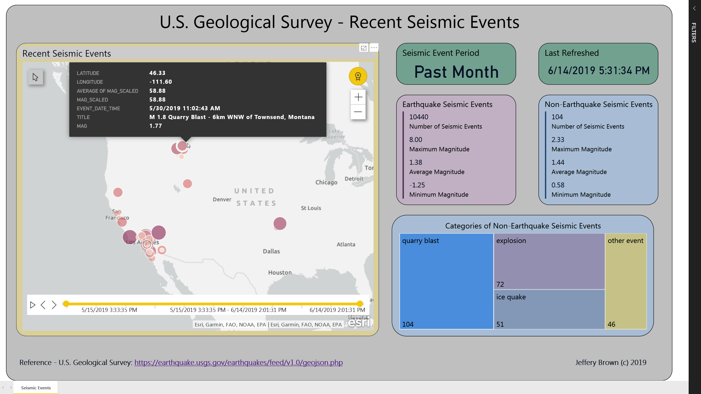

# Earthquake

This application provides Visualization of Recent Global Earthquake Activity based upon data pulled dynamically via an API Endpoint maintained by the U.S. Geological Survey (USGS).

# Technologies Used

* Main Visualization

    * JavaScript
    * D3
    * Leaflet

* Additional Visualization:
    * Power BI

# Reference

* GitHub: https://github.com/daddyjab/Earthquake
* Visualization (JavaScript, D3, Leaflet): https://daddyjab.github.io/Earthquake
* Visualization (Power BI): https://github.com/daddyjab/Earthquake/resources/USGS%20Seismic%20Events.pbix

# Contributions

* Jeffery Brown: Designed and implemented all application-specific code and visualations for this application
* Libraries:
    * Leaflet Slider Control library: https://github.com/dwilhelm89/LeafletSlider
* Data:
    * U.S. Geological Survey Earthquake GeoJSON Summary Feed: https://earthquake.usgs.gov/earthquakes/feed/v1.0/geojson.php
    * World tectonic plates and boundaries (Hugo Ahlenius) Dataset Site: https://github.com/fraxen/tectonicplates/tree/master/GeoJSON

# Summary

This application provides a visualization of earthquake events observed within the last hour, day, week or month.

## Main Visualization: JavaScript, D3, Leaflet
The visualization shown in the screenshot in Figure 1 below is implemented using Leaflet as an Overlay map with several options of Base maps.  Earthquake events are denoted by cicles, with circle radius and color proportional to the magnitude of each event.  A slider control allows the user to select a range of times for which events should be displayed, with the limits based upon the dataset being used.  Clicking an earthquake event displays a pop-up information box.

An additional Overlap map shows world techtonic plate boundaries, providing a visual point of reference vs. nearby earthquake events.  

| Figure 1: Earthquake - Screenshot of Visualization - Javascript, D3, Leaflet |
|----------|
|  |

## Additional Visualization: Power BI
After completing the main visualization using JavaScript, D3, and Leaflet, the visualization was implemented using an additional method: Microsoft Power BI.  The report was created using Power BI Desktop (Figure 2) and then published to Power BI Service (Figure 3).

The USGS seismic event data used used as the data source, and a query was implemented to clean the data and transform the data columns as required. An ArcGIS visualization was used to plot the seismic events, and other visualization elements provide summary information for various types of seismic events, with additional empahsis on causes other than earthquakes.  A parameter was used to select the period over which seismic events were obtained: past hour, past day, past week, or past month.

| Figure 2: Earthquake - Screenshot of Visualization - Power BI Desktop |
|----------|
|  |

| Figure 3: Earthquake - Screenshot of Visualization - Power BI Service |
|----------|
|  |
