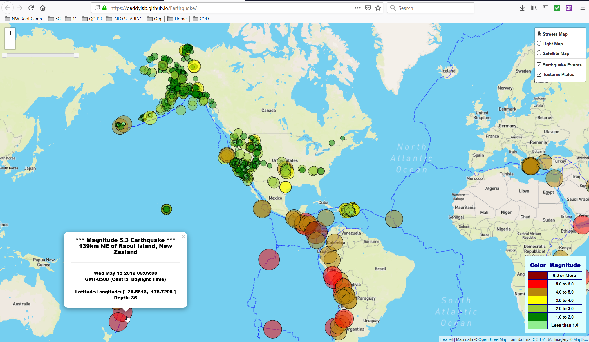

# Earthquake

This application provides Visualization of Recent Global Earthquake Activity based upon data pulled dynamically via an API Endpoint maintained by the U.S. Geological Survey (USGS).

# Technologies Used

* JavaScript
* D3
* Leaflet

# Reference

* GitHub: https://github.com/daddyjab/Earthquake
* Visualization: https://daddyjab.github.io/Earthquake

# Contributions

* Jeffery Brown: Designed and implemented all application-specific code and visualations for this application
* Libraries:
    * Leaflet Slider Control library: https://github.com/dwilhelm89/LeafletSlider
* Data:
    * U.S. Geological Survey Earthquake GeoJSON Summary Feed: https://earthquake.usgs.gov/earthquakes/feed/v1.0/geojson.php

# Summary

This application provides a visualization of earthquake events observed within the last 7 days.

The visualization shown in the screenshot in Figure 1 below is implemented using Leaflet as an Overlay map with several options of Base maps.  Earthquake events are denoted by cicles, with circle radius and color proportional to the magnitude of each event.  A slider control allows the user to select a range of times for which events should be displayed, with the limits based upon the dataset being used.  Clicking an earthquake event displays a pop-up information box.

An additional Overlap map shows world techtonic plate boundaries, providing a visual point of reference vs. nearby earthquake events.  

| Figure 1: Earthquake - Screenshot of Visualization |
|----------|
|  |
